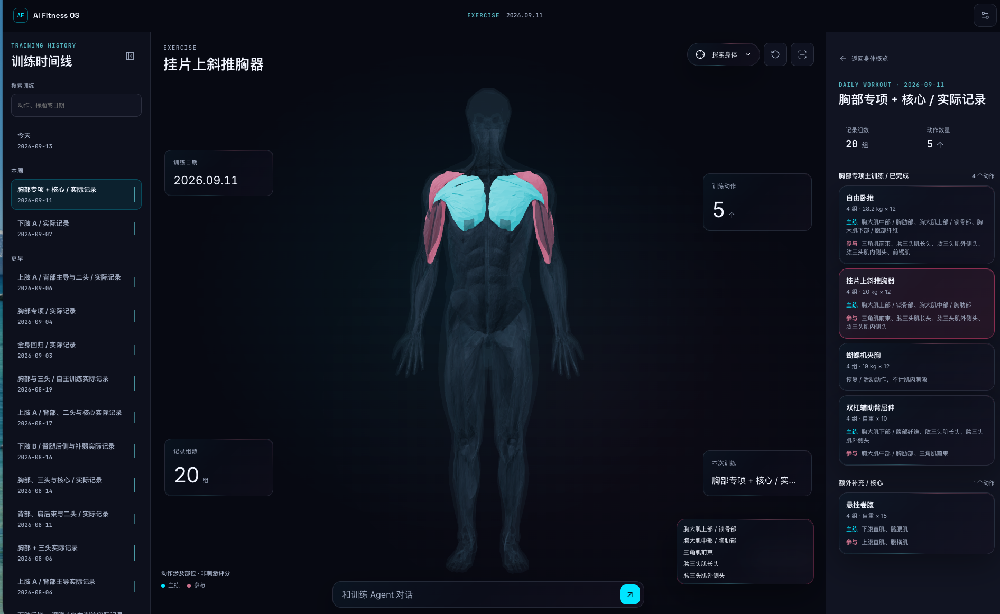

# AI Fitness OS

**以身体为入口，记录训练、探索肌肉，与 AI 一起安排下一次训练。**

AI Fitness OS 是一个运行在本机的个人训练工作区。你可以在 3D 人体上查看训练涉及的肌群，回顾历史动作和组次，再通过对话整理训练目标与计划。档案和训练记录保存在自己的工作区中，使用可读、可备份的 YAML 文件。



[快速开始](#快速开始) · [首次使用](#首次使用) · [数据与备份](#数据与备份) · [开发与文档](#开发与文档)

## 可以做什么

- **从人体回顾训练**：旋转、选择肌群，查看相关训练历史和动作，了解近期训练分布。
- **查看每一次训练**：通过时间线找到某一天，回顾动作、组数、次数与负重。
- **与 AI 教练协作**：通过对话整理个人档案、讨论训练安排；计划与实际完成记录分开保存，正式写入由本地程序校验。
- **保留自己的数据**：应用代码与个人工作区分离，训练数据可以独立备份，也可以用私有 Git 仓库管理。
- **选择喜欢的外观**：内置 Neon 与 Graphite 两套主题，支持桌面与窄屏布局。

当前定位是**单人本地试用**，朋友可以各自安装、使用自己的工作区和模型 Key。AI 会话由 DeepSeek Harness（DSH）提供；对话需要联网调用模型，相关上下文会发送至模型服务。

## 快速开始

本地验证环境为 **Linux、Node.js 24、npm 11**。准备好 Git 和 Node.js，以下命令在 Bash 中执行：

```bash
git clone https://github.com/liuchuan01/trainng.git
cd trainng
npm ci

# 将个人数据放在代码仓库之外
export WORKSPACE_ROOT="$HOME/my-fitness-workspace"
npm run fitness -- init
npm run dev
```

打开 **[http://127.0.0.1:5173](http://127.0.0.1:5173)**，保持启动命令所在的终端运行；退出时按 `Ctrl+C`。

以后在新的终端中启动，也请先设置同一个 `WORKSPACE_ROOT`，再从项目目录运行 `npm run dev`。未设置时，应用会使用仓库内的 `.workspaces/default`，因此可能看到另一个空工作区。

新工作区不会导入案例或他人的训练记录，自动计划默认关闭。想先了解数据长什么样，可以查看[虚构案例](examples/fitness-starter/README.md)。

偏好容器运行？请看 [Docker 部署说明](deploy/README.md)。默认服务监听本机地址；手机或其他电脑访问需要另外配置，当前不提供多人共享账号系统。

## 首次使用

1. 打开右上角的**配置后台**，在 **DeepSeek** 卡片中填写自己的 API Key。未配置 Key 时仍可探索人体，AI 对话需要有效 Key。
2. 回到首页，点击**建立我的训练档案**，与教练交流目标、训练经验、时间和器械条件。
3. 核对教练整理的档案摘要，再讨论第一份训练安排。
4. 训练后报告实际完成的动作、组次和负重，让计划与真实训练记录保持区分。

详细流程见[首次建档与首训](docs/product/ONBOARDING.md)。本地服务、数据校验与浏览器流程已有自动回归；完整真实模型建档和写入、生产部署仍未完成验收，当前适合试用与反馈。验证范围见 [DSH 集成记录](docs/dsh-integration/DSH-FITNESS-INTEGRATION.md)。

## 数据与备份

个人工作区与应用代码分别管理：

```text
my-fitness-workspace/
├── fitness/   # 个人档案、计划、实际训练记录与身体指标
├── config/    # 应用设置与模型凭据
└── runtime/   # 对话、调度状态和建档草稿
```

备份 `fitness/` 可以保留正式训练数据；如果还要保留设置、Key 和聊天，需要分别备份 `config/` 与 `runtime/`。聊天恢复还涉及 DSH 版本和原工作区路径，不能只凭复制文件保证恢复。

你可以只在 `fitness/` 中建立**私有 Git 仓库**。应用不会自动提交或推送，也不要将凭据、聊天或整个工作区加入公开仓库。

从旧版升级且已有训练数据时，请先备份，再按[迁移与恢复说明](docs/dsh-integration/LOCAL-DEVELOPMENT.md#其他机器升级时保留记录)操作；个人数据不会随应用代码自动同步。

## 开发与文档

前端使用 React、TypeScript、Vite 和 Three.js；本地 Node.js 服务负责 YAML 校验、计算与文件写入，DSH 负责 Agent 会话。

| 目录                    | 内容                         |
| ----------------------- | ---------------------------- |
| `src/`                  | 前端页面、交互和 3D 人体     |
| `server/`、`shared/`    | 本地服务、共享类型与数据契约 |
| `dsh-fitness/`          | DSH 集成与会话界面           |
| `public/`、`resources/` | 浏览器静态资源、公共训练规则 |
| `tooling/`、`tests/`    | 构建配置与自动化测试         |
| `docs/`                 | 产品、设计、数据与工程文档   |

常用命令均在项目根目录运行：

```bash
npm run dev          # 同时启动前端与本地服务
npm run build        # 构建前端和服务端
npm run typecheck    # TypeScript 检查
npm test             # 单元与组件测试
```

本地服务默认位于 `http://127.0.0.1:8787`，DSH Host 使用端口 `3080`。更多开发、集成测试和配置说明见下面的文档：

- [本地运行与数据迁移](docs/dsh-integration/LOCAL-DEVELOPMENT.md)
- [数据契约与 CLI](docs/data/FITNESS-DATA-ARCHITECTURE.md)
- [结构模板](templates/fitness/)与[虚构案例](examples/fitness-starter/README.md)
- [技术架构](docs/engineering/TECHNICAL-ARCHITECTURE.md)与[编码规范](docs/engineering/CODING-STANDARDS.md)
- [贡献前的项目导航与路线图](AGENTS.md)

## 许可证

原创源码与文档采用 [Apache License 2.0](LICENSE)。人体模型等第三方资源保留独立许可，详见[第三方资源说明](docs/engineering/THIRD-PARTY-NOTICES.md)。
