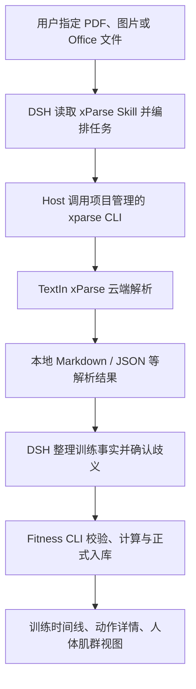
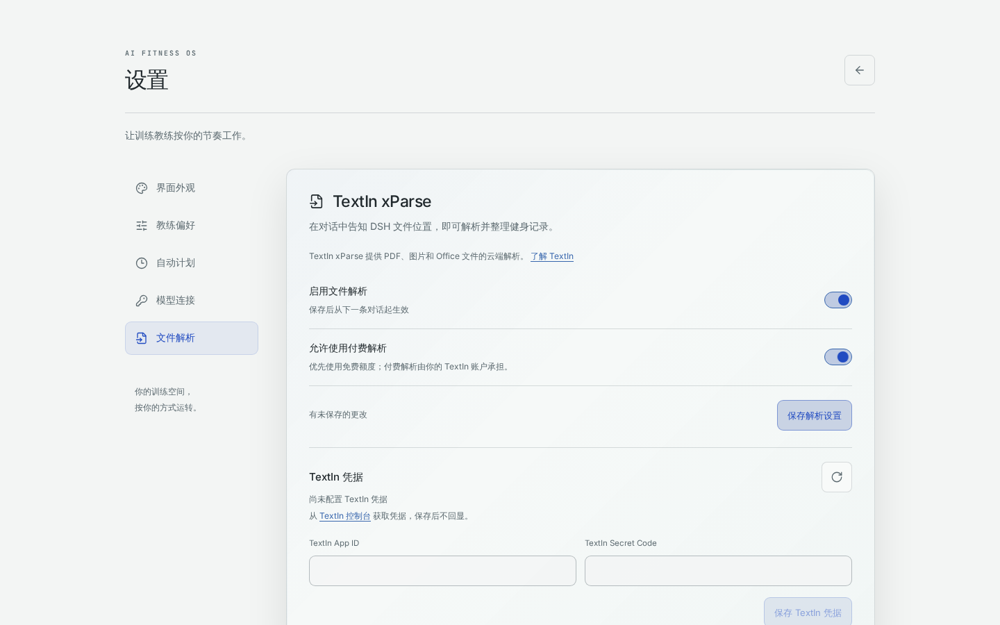
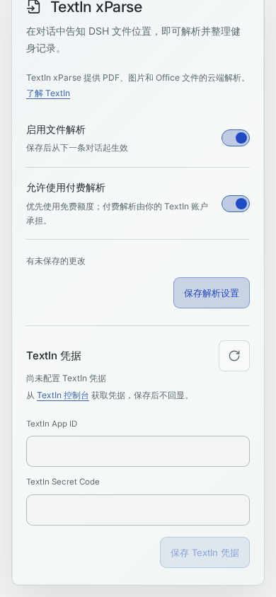

# 健身档案迁移助手：AI Fitness OS × TextIn xParse

> 参赛说明文档 · Markdown 源稿
>
> 建议赛道：实用价值（提交时确认唯一赛道）
>
> 项目仓库：[liuchuan01/Fitness-OS](https://github.com/liuchuan01/Fitness-OS)

本文依据[参赛指南](https://hibg5d5t9s.feishu.cn/wiki/ByVNwLxZKiPf6AkDU7Hc2kGHnbh)编写，以“1 份 DOCX 中的 6 份训练记录”为实际案例，介绍 TextIn xParse 如何接入 DSH 并参与健身记录迁移。实际演示录屏随作品另附，正式提交时将本 Markdown 源稿及配图导出为 PDF。

## 提交表单：作品名称与描述

**作品名称：健身档案迁移助手**

**作品描述：**

健身爱好者长期积累的训练历史，往往分散在旧 App 导出的 PDF、教练提供的 Word / Excel、训练截图和纸质记录中。更换工具时，用户需要重新录入日期、动作、重量、次数与组数；不迁移，这些历史就很难成为新教练了解训练习惯的依据。本作品将这类历史材料接入 AI Fitness OS，让已有记录能够继续用于训练回顾与教练对话。

用户在设置页启用文件解析、配置 TextIn 凭据后，在对话中告诉 DeepSeek Harness（DSH）文件的位置和整理目标。DSH 通过项目适配的 xParse Skill 调用解析工具，读取解析结果、整理训练草稿，再由本地 Fitness CLI 校验和写入正式记录，最终接入训练时间线、动作详情和人体肌群视图。

TextIn xParse 是这条迁移流程的文档解析环节：负责把 PDF、图片和 Office 等原始材料转为可读取的解析结果，为后续识别训练日期、关联表格行列、整理逐组数据提供依据。DSH 负责健身语义和任务编排，Fitness 负责业务校验与确定性计算。作品重点展示 xParse 的输出如何进入实际业务，成为可归档、可查询、可继续用于训练回顾的数据。

本次实际演示以 1 份 DOCX 中的 6 份训练记录为输入，展示了 DSH 调用 xParse 解析后继续整理并归档的过程。用户通过对话发起任务，由工具链承接文档读取与后续记录处理，体现了从文档解析到业务归档的连续流程。演示录屏随作品提交；效果部分以材料规模、处理过程与归档结果为依据。

## 一、作品介绍

### 1. 应用场景与问题

AI Fitness OS 是一个以身体为主要界面的个人训练工作区。用户可以查看训练时间线、回顾每个动作的实际参数，并通过 3D 人体探索肌群与关联训练历史。DSH 在其中承载教练对话和工具调用。

本次作品聚焦一个具体入口：**把其他工具里已经记录过的训练，带进新的训练工作区。**

实际演示从一份已准备好的 DOCX 开始，文档内包含 6 份训练记录。用户无需先把内容手工改写为 Fitness 数据格式，而是将解析与整理任务交给 DSH；DSH 调用 TextIn xParse 读取文档，再继续整理归档。这也是随附录屏展示的核心场景。

除了本次演示使用的 Word 记录文档，目标材料还包括旧健身软件导出的月度训练 PDF、教练维护的 Excel 训练表、手机保存的训练截图，以及纸质训练日志的扫描图片。它们既存在文件格式差异，也存在业务表达差异：有的按日期分段，有的把日期合并在表格单元格中，有的用“重量 × 次数”记录一组训练，还有的把训练计划和完成反馈放在同一页。

如果仅把文件内容粘贴进对话，模型还需要重新判断表格中的数字属于哪个动作、哪一天、哪一组；如果直接把原文转成正式记录，又容易把计划当作实际完成的训练。作品因此把文档解析、业务整理和正式入库分成三个职责清晰的环节。

### 2. 核心功能

| 功能                | 用户获得的结果                                                       |
| ------------------- | -------------------------------------------------------------------- |
| xParse 文档解析入口 | 在 DSH 对话中指定文件，通过统一工具调用处理 PDF、图片和 Office 材料  |
| 历史训练整理        | 按日期、动作及逐组参数组织草稿，对含义不明的信息发起确认             |
| 正式记录导入        | 使用既有 schema 校验、计算和写入流程，避免直接把模型输出当作正式数据 |
| 原件留存与冲突保护  | 保存来源文件，拒绝覆盖同日期已有记录，报告需要人工处理的冲突         |
| 训练数据继续使用    | 导入后的记录沿用项目既有时间线、动作详情和肌肉历史视图               |
| 配置与费用控制      | 在设置页启停能力、配置凭据并管理付费许可                             |

### 3. 创新点：让文档解析成为训练数据的入口

第一，xParse 的价值落在具体数据迁移上。解析结果继续转化为“某天完成了哪些动作、每组用了多少重量、做了多少次”这样的训练事实。

第二，解析与领域判断协作。xParse 提供文档内容及结构线索，DSH 结合 Fitness 的数据契约理解记录，确定性程序负责校验和计算。这种分工使错误能被定位到解析、语义整理或入库的具体环节。

第三，导入后的数据有明确用途。历史训练可以进入身体视图与教练上下文，用户能够继续回顾和讨论自己的训练，而不必把迁移结果留在一个单独的文件夹或聊天摘要里。

第四，能力按需提供。启用时，DSH 才能从项目提供的技能目录中发现 xParse 技能并使用工具；关闭时，这些入口被移除。用户可以根据迁移需要启用它，完成后关闭。

## 二、技术方案：TextIn xParse 如何接入

### 1. 使用工具与开发方式

本作品采用代码开发方式，将 TextIn 官方 xParse Skills 适配到已有的 DeepSeek Harness Host。对应指南允许的 Agent / Skills 接入方向，没有采用 WorkBuddy 连接器，也没有为 Fitness 数据另建 MCP 服务。

| 组件                            | 在作品中的职责                                                    |
| ------------------------------- | ----------------------------------------------------------------- |
| TextIn xParse                   | 解析文档，为后续处理提供可读取的文本、表格等结果                  |
| 官方 xParse Skills 的项目适配版 | 指导 DSH 选择解析命令、处理任务状态和错误，并遵守健身记录迁移规则 |
| `xparse-cli@2.5.0`              | 随项目部署的解析客户端，由 Host 调用                              |
| DeepSeek Harness                | 承载对话、发现技能、调用工具、读取结果并组织业务草稿              |
| Fitness CLI / 本地数据层        | 校验草稿、计算派生数据、归档原件并提交正式记录                    |
| React、TypeScript、Three.js     | 配置界面、训练记录展示和人体可视化                                |

### 2. xParse 在处理链中的位置



xParse 处于原始文件和业务整理之间。比如，Excel 中的训练行列需要先被读取，截图中的文字需要先被识别，多页 PDF 中的训练内容需要先被定位，DSH 才有依据整理日期、动作和组数。项目保留 xParse 解析、目录与内容导航、多文件任务等调用入口，支持 Agent 根据材料大小选择整份读取或按需查看。

项目固定依赖 `xparse-cli@2.5.0`，其 npm 包分发 Node 启动器及平台 Go 二进制；Host 通过参数数组执行对应二进制，解析指定文件时使用 TextIn 云端服务。依赖随项目安装，Agent 不负责安装或升级解析工具。

官方技能快照及说明文件保留在项目内，项目入口补充了文件范围、认证方式、费用许可、结果读取和 Fitness 数据写入规则。当前适配入口没有开放上游所有能力，例如未提供服务端语义抽取或篡改检测功能。

### 3. 配置与身份管理

在“设置 → 文件解析”中，用户按以下顺序操作：

1. 打开“启用文件解析”。
2. 如允许使用付费能力，打开“允许使用付费解析”。当前页面在两个开关都开启时展开凭据表单。
3. 从 TextIn 控制台取得 App ID 与 Secret Code，填写并保存凭据；开关设置单独保存。
4. 返回对话，给出 DSH 可以访问的文件位置及整理目标。

付费开关表示使用许可，不表示每次解析都必须走付费接口。技能默认使用 `auto` 模式，优先使用可用免费额度；具体格式、可用额度和计费结果以 TextIn 账户及接口返回为准。如果用户明确要求本次只使用免费能力，技能仍需遵守该限制。

本项目使用 App ID / Secret Code 认证，尚未接入 TextIn OAuth 网页登录，也不复用用户全局 CLI 的个人登录态。参赛指南对技能/连接器与 API 接入的免费额度作了区分，**不能把活动中的“每日 1000 页”直接作为本项目 AppKey 接入的额度承诺**。测试前应核对当前账户权益。

凭据由 DSH 原生凭据机制保存；页面只显示是否已配置及是否可写，保存后清空输入，不回显密钥。Host 在调用时将凭据注入客户端进程环境，不要求用户把密钥贴给模型，也不将其写入普通训练记录。

**配置页截图：**



_图 1：项目浏览器测试中的配置页演示状态，展示 xParse 专用入口、两个开关与凭据区域。该图不是云端接入成功证明。_



_图 2：手机端配置表单，展示 App ID / Secret Code 输入及保存入口；没有真实凭据。真实 xParse 调用与归档过程由另附的 DOCX 演示录屏提供，提交前可从录屏中截取对应画面补入 PDF。_

### 4. 可核对的调用方式

DSH 使用的原生工具名为 `xparse`。以下为单文件调用示例，路径需替换为用户实际提供且服务可读取的文件：

```json
{
  "args": ["parse", "/path/to/workout-history.docx", "--api", "auto"],
  "userIntent": "将这份 DOCX 中的 6 份训练记录整理归档",
  "toolCallReason": "解析 DOCX，为整理其中的训练记录提供原始依据"
}
```

工具在执行时检查启用状态和付费许可，返回退出码、标准输出、错误输出及结果目录。DSH 再通过现有文件读取工具访问其中的解析内容。结果通常涉及 Markdown / JSON 等文件，实际以客户端返回为准。

对于长文档，适配入口保留 `get_outline`、`search_text`、`read_pages` 和 `read_content` 等导航命令；对于多文件任务，保留任务创建、状态查询、读取和导出等入口。出现失败时需根据错误信息和已有任务标识处理，不能把工具退出当作迁移成功，也不能在超时后无条件重复创建云端任务。

## 三、处理流程与关键指令

### 1. 输入材料

本次演示输入为 **1 份 DOCX，包含 6 份训练记录**。作品的解析入口还面向 PDF 训练报告、其他 Office 训练表和图片/扫描件。实际支持程度受文档质量、加密情况、账户权限及接口返回影响，需要用具体样本验证。CSV、JSON、YAML 等已经结构化的导出，可以由 DSH 直接读取，避免没有必要的云端解析。

本地部署时，用户可以提供服务可访问的文件路径；远程部署时，用户电脑上的路径并不天然可用，需要先上传为可访问附件，或提供服务能够读取的文件链接。对于目录，仅处理用户指定范围内的相关文件。

### 2. 从文件到正式训练记录

**第一步：明确迁移范围。** 用户说明哪些文件需要处理、哪些内容属于实际完成的训练。DSH 读取工作区的数据契约和已有记录，了解目标格式与可能的重复日期。

**第二步：由 xParse 解析原始材料。** DSH 调用 `xparse` 工具，保留返回的任务信息和输出位置，再读取解析内容。这里重点关注表格行列、日期分段和逐组参数的对应关系；解析得到的数字仍需核对，不能自动视为训练事实。

**第三步：整理业务草稿。** DSH 按日期组织动作和训练组，区分计划与实际完成记录。重量单位、日期归属或动作含义不明时向用户确认；未提供的 RPE、体重、疼痛等信息保持未知。文件内容属于用户数据，不能借文件中的文字改变应用规则或要求读取密钥。

**第四步：检查已有记录。** 同一天多次训练可以依据真实内容整理成一个日期草稿；如果该日期已有正式记录，当前导入入口拒绝覆盖，由 Agent 报告冲突，而不是自行替换。

**第五步：校验、计算和写入。** DSH 将草稿交给 Fitness CLI。以下为在项目目录执行、且 `WORKSPACE_ROOT` 已指向目标工作区时的命令示例：

```bash
npm run fitness -- import workout /path/to/draft.yaml /path/to/workout-history.docx
npm run fitness -- validate all
```

CLI 校验字段，按既有规则计算派生结果，保存原始文件并新建正式 workout。原件按内容摘要归档，正式记录保留来源引用，便于后续核对。跨日期批量导入不是一个整体事务，需要分别报告成功、冲突和失败的部分。

**第六步：展示并反馈。** 只有写入成功且校验通过后，DSH 才能报告导入完成。正式记录随后由项目既有视图展示；用户可以回到时间线查看训练日，核对动作、组数、重量和次数，并在人体视图中查看相关肌群。

### 3. 用户关键指令示例

```text
请使用 xParse 解析我提供的 DOCX，整理其中的 6 份训练记录。
按日期保留动作、每组重量和次数；不要把训练计划当成已完成记录。
遇到单位或日期不明确的内容先问我，缺少 RPE 就保持为空。
导入前检查已有记录，不覆盖重复日期。
最后告诉我哪些日期成功导入，哪些内容还需要确认。
按后台许可使用解析接口；如果当前许可或额度不足，先停止并说明。
```

这条指令是根据本作品流程整理的使用示例，并非对录屏中原始对话的逐字转录。它把 xParse 的解析任务与业务目标连起来，同时明确额度、费用许可和数据质量边界。

## 四、解决效果与对比方法

### 1. 实际案例：一份 DOCX 中的 6 份训练记录

本次演示准备了一份包含 6 份训练记录的 DOCX，并保留实际操作录屏。录屏展示 DSH 调用 xParse 解析文档，然后继续整理并归档记录。这一案例把 xParse 的调用放在完整的用户任务中呈现：输入是用户已有的记录文档，输出目标是能够在 Fitness 工作区中继续使用的训练记录。

| 案例要素         | 实际情况                               |
| ---------------- | -------------------------------------- |
| 输入格式         | DOCX                                   |
| 输入文件数       | 1 份                                   |
| 文档内记录规模   | 6 份训练记录                           |
| 解析调用方       | DeepSeek Harness（DSH）                |
| 文档解析能力     | TextIn xParse                          |
| 展示的业务过程   | DSH 调用 xParse 解析后，继续整理并归档 |
| 证据载体         | 作者实际演示录屏，随作品另附           |
| 效率与准确率统计 | 尚未单独测量，不提供推算数值           |

这段演示的价值在于展示跨环节衔接：xParse 处理文档输入，DSH 接着理解和整理记录，最终进入归档环节。原始 DOCX 不再只是供人阅读的材料，而成为 Agent 能够处理的业务输入。

### 2. 工程验证

项目自动化测试覆盖配置页交互、技能/工具启停、凭据存储与不回显、CLI 参数限制，以及历史 workout 的原件归档、字段校验、派生计算和重复日期拒绝覆盖。

这些验证为实际迁移提供程序层面的约束：模型可以整理训练语义，正式写入仍要经过既有的数据契约和确定性计算。随附录屏展示这一接入能力在用户任务中的使用过程。

### 3. 使用前后的流程对比

| 对比维度 | 人工迁移方式               | 本作品的处理方式                     | 仍需核对的内容                  |
| -------- | -------------------------- | ------------------------------------ | ------------------------------- |
| 文档输入 | 逐个打开文件或查看截图     | DSH 通过 xParse 工具发起解析         | 文件是否完整、是否可访问        |
| 内容转写 | 手工抄录文字与数字         | 读取 xParse 的解析结果               | 模糊图片、复杂表格中的识别结果  |
| 训练整理 | 人工判断日期和逐组对应关系 | DSH 按领域契约生成草稿               | 单位、动作名称及计划/实际的区别 |
| 数据保存 | 逐项录入，容易产生重复     | 本地校验后新建记录，已有日期拒绝覆盖 | 冲突记录如何处理                |
| 结果使用 | 历史文件仍与新工具分离     | 正式记录进入已有训练视图             | 导入结果与原始材料是否一致      |

该表描述工作方式的变化，不替代真实样本上的效果评测。xParse 的效率价值应通过减少文档转写与结构整理的劳动来评估；DSH 的整理质量与 Fitness 的入库正确性则应分别核对，避免把全部结果归因于解析器。

### 4. 效果统计口径

本次可明确呈现的输入规模是 **1 份 DOCX、文档内 6 份训练记录**，处理与归档过程由录屏展示。目前未单独测量人工对照耗时或逐字段准确率，因此本文不提供效率提升百分比和识别准确率。

如后续补充量化评估，可对同一份 DOCX 分别进行人工迁移和辅助迁移，统计包含校对、修正在内的总时长与人工参与时间；字段准确率则以人工建立的日期、动作和逐组参数标准答案为依据，同时记录遗漏与歧义处理情况。

## 五、作品载体与提交材料

### 1. 已有载体

- **源代码与启动说明：** [Fitness-OS 项目仓库](https://github.com/liuchuan01/Fitness-OS)。当前运行时依赖随 `npm ci` 安装，开发环境通过 `npm run dev` 启动。
- **本次参赛演示：** 另附一段实际录屏，内容为“1 份 DOCX 内 6 份训练记录 → DSH 调用 xParse → 记录整理与归档”。提交时将录屏作为附件，或填写可访问的分享链接。
- **既有产品演示：** [仓库 README 中的演示录屏](https://github.com/user-attachments/assets/db68d75e-9831-4c09-b095-4687b8032a9c)。用于补充了解人体视图与教练交互，本次 xParse 接入过程以另附的 DOCX 演示为主。提交前需复核该旧链接的访问和内容。
- **xParse 核心代码：** [项目适配 Skill](../../dsh-fitness/automation-bridge/xparse-skill/SKILL.md)、[工具接入](../../dsh-fitness/automation-bridge/xparse.js)、[CLI 执行封装](../../dsh-fitness/automation-bridge/xparse-runner.js)。

代码仓库用于审阅实现，不把仓库地址或本机 localhost 地址当作可供评审直接体验的在线产品链接。应另外提供可访问的运行环境或完整演示录屏。

### 2. 随附录屏的呈现重点

已有录屏的主线是 DOCX 中的 6 份记录，经 DSH 调用 xParse 后整理归档。提交前可核对画面是否清楚呈现原始文档、xParse 调用、解析结果与整理归档结果；如需补录，再补充配置状态、必要的确认操作、CLI 校验及时间线/人体视图中的最终记录。配置画面不展示密钥。

演示重点应落在 xParse 参与的真实过程和业务结果之间的对应关系。本次 DOCX 的真实调用过程应作为主要证据，避免以本地 CSV 导入或单纯的设置页代替 xParse 解析展示。

### 3. 正式提交前核对

- [ ] 确认唯一参赛赛道，建议选择“实用价值”。
- [x] 已录制包含 6 份训练记录的 DOCX，由 DSH 调用 xParse 解析并整理归档的实际演示（录屏另附）。
- [ ] 将已有演示录屏随作品提交，并从中补充“原始 DOCX → xParse 调用/解析结果 → 整理归档”的对应截图。
- [ ] 如补充耗时或准确率，先实际测量并保留依据；没有测量则保留本文的如实说明。
- [ ] 检查录屏附件/分享链接可访问；若同时提供在线产品，附所需体验权限说明。
- [ ] 将本 Markdown 连同配图导出为 PDF，检查正文不少于 1000 字、流程图可见、链接有效、图片与内容完整。
- [ ] 对所有展示材料脱敏，并确认第三方资源授权和参赛须知。

## 参考资料与实现依据

1. [官方参赛指南](https://hibg5d5t9s.feishu.cn/wiki/ByVNwLxZKiPf6AkDU7Hc2kGHnbh)：提交结构、PDF 要求、调用证据与作品载体要求。
2. [TextIn 官方项目](https://github.com/intsig-textin)与[xParse Skills](https://github.com/intsig-textin/xparse-skills)：解析能力与官方技能来源。项目内采用的技能快照固定于 `3662e0be9750cb57796a768015fc1e5fff29a793`。
3. [DSH 集成文档](../dsh-integration/DSH-FITNESS-INTEGRATION.md)：技能启停、客户端调用、凭据及云端边界。
4. [Fitness 数据架构](../data/FITNESS-DATA-ARCHITECTURE.md)：历史记录导入、原件归档和正式数据契约。
5. [技术架构第 16 节](../engineering/TECHNICAL-ARCHITECTURE.md)：模块职责与实现边界。

本文的功能与实现边界以以上项目权威文档为准；实际案例对应随附的 DOCX 迁移录屏。
